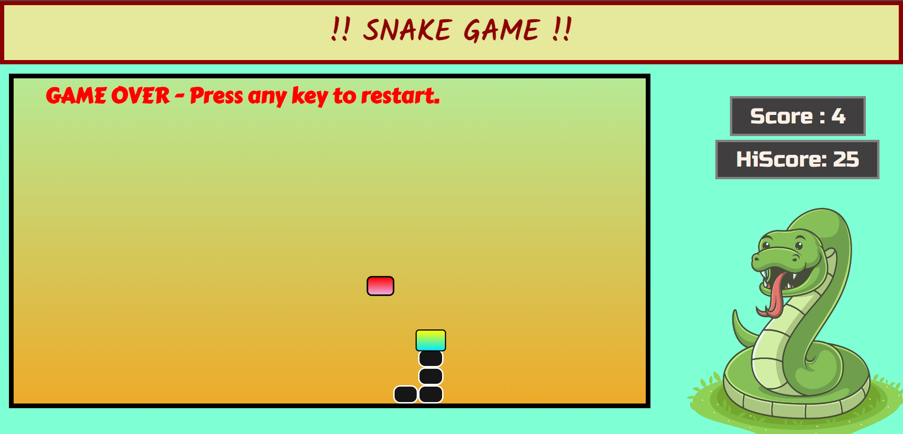

# Snake Game

A classic Snake Game implemented using HTML, CSS, and JavaScript. Eat the food, grow your snake, and try to achieve the highest score! 



## Table of Contents

- [Demo](#demo)
- [Features](#features)
- [Installation](#installation)
- [Usage](#usage)
- [Controls](#controls)
- [Contributing](#contributing)

## Demo

You can play the game live by visiting the [demo link](https://your-demo-link-here.com).

## Features

- Classic Snake Game experience.
- Responsive design and visual enhancements.
- Audio effects for eating food, game over, and turning.
- Local storage to track and display high score.

## Installation

1. Clone the repository:

   ```bash
   git clone https://github.com/shreyasp-07/snake-game.git
   ```

2. Navigate to the project directory:

   ```bash
   cd snake-game
   ```

3. Open the `index.html` file in your preferred web browser.

## Usage

1. Launch the game by opening the `index.html` file in your web browser.

2. Use the arrow keys to control the snake's movement.

3. Eat the food (red blocks) to increase your score and snake's length.

4. Avoid colliding with the walls and yourself, as it will end the game.

## Controls

- Use the Arrow Up key to move the snake upwards.
- Use the Arrow Down key to move the snake downwards.
- Use the Arrow Left key to move the snake to the left.
- Use the Arrow Right key to move the snake to the right.

## Contributing

Contributions are welcome! If you find any issues or have suggestions, please feel free to create a pull request or submit an issue.

1. Fork the repository.

2. Create a new branch:

   ```bash
   git checkout -b feature/your-feature-name
   ```

3. Make your changes and commit them:

   ```bash
   git commit -m "Add your commit message here"
   ```

4. Push to the branch:

   ```bash
   git push origin feature/your-feature-name
   ```

5. Open a pull request.
